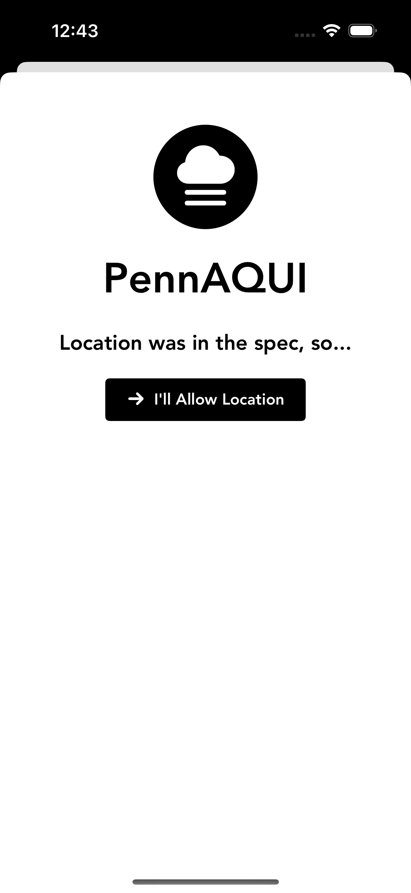
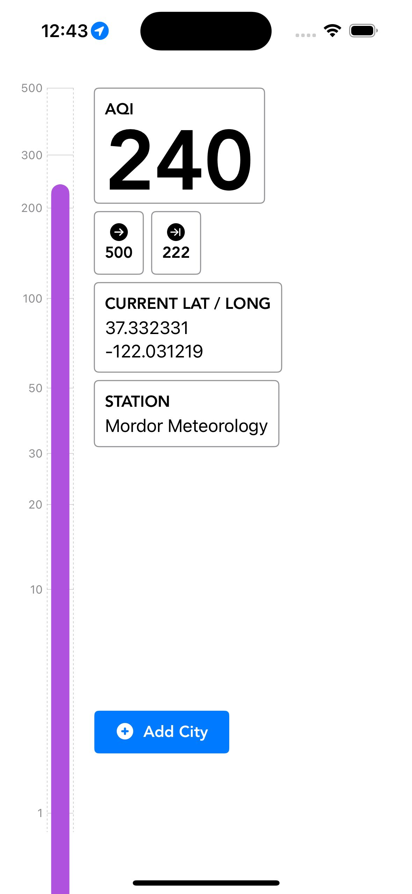

## PennAQUI

## Overview
This is my PennAQI submission -- the "U" stands for `swiftUi`.

| Onboard | Main |
|---|---|
|||

## Notes
- I interpreted "Show user lat/long" as "Use CoreLocation", and _then_ saw the API returned IP-based lat/long. More to show in the implementation!
- Architecture-wise, would love to chat in the call about testability, as there's a number of directions it could go
    - `AddCitySheet` encapsulates its networking. Can be made `static` (with dependency injected `Store`) for unit testing
    - `Store` owns its own network call when user coordinates are received

## Running

- Create `Keys.xcconfig` in `PennAQUI/Domian/Service` and add the API key as specified in `KeysConfig.xcconfig`
